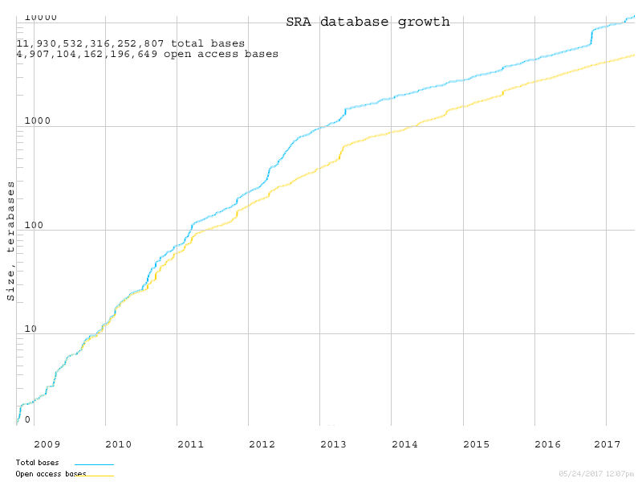
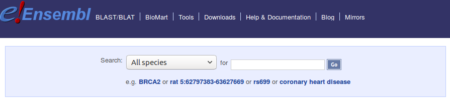

```{r setup, include=FALSE}
knitr::opts_chunk$set(echo = FALSE)
```

# Buts et approche

## Buts de la présentation

### **Démystifier les bases de données biologiques:**

* Définition des bases de données biologies
* Les types de bases de données
* Laquelle choisir?

### **Présenter les ressources disponibles sur R/Bioconductor**

### **Répondre à vos questions**

# Les bases de données biologiques

## Les bases de données | Définition (adaptée de Wikipedia)

Une base de données est un outil qui permet de **stocker** et de **retrouver** de l'information.

## Les bases de données biologiques | Définition (adaptée de Wikipedia)

Une base de données est un outil qui permet de **stocker** et de **retrouver** de l'information **biologique**.

> - Génome de référence
> - Données expérimentales
> - Articles scientifiques
> - Annotations
> - Etc...

## Structure des bases de données {.smaller}

### Simple

```{r echo=FALSE}
a <- read.table("_data/fantom5_head.bed")
colnames(a) <- c("chrom", "chromStart", "chromEnd", "name", "score", "strand")
knitr::kable(a[1:5,1:6])
```

</br>
5 premières lignes et 6 premières colonnes du fichier human_permissive_enhancers_phase_1_and_2.bed.gz téléchargé sur le site de Fantom5 (http://fantom.gsc.riken.jp/5/datafiles/latest/extra/Enhancers/)

## Structure des bases de données | Complexe {.smaller}


<center>Figure produite par Régis Ongaro.</center>

## Progression des BD biologiques (1) {.smaller}

<center>

</center>

http://scienceblogs.com/digitalbio/files/2015/01/number-of-dbs-2015-400x286.png


## Progression des BD biologiques (2)

<center>


https://www.ncbi.nlm.nih.gov/Traces/sra/i/g.png
</center>

## Les limites des bases de données

</br><br>
<center>
### **Erreurs** d'annotation et de séquençage.

### Information **redondantes**

### **Biais** envers certaines espèces
</center>

---

<center>

</center>

## Types de base de données

- Primaires
- Secondaires
- Spécialisés

## Bases de données primaires

<center>

http://www.ddbj.nig.ac.jp/wp-content/uploads/insdc_shoukai550_20130515.png
</center>

## Bases de données secondaires

- L'information brute des bases de données primaires est transformée:
    - Outils bioinformatiques
    - Vérification par des experts
    - Croisements entre plusieurs bases de données

## Prédiction de gène et annotations (1)


</br>

* Définir la structure du gène (exon, intron, UTR, etc...)
* Définir les isoformes des gènes
* Obtenir la position des gènes sur le génome

</br>
Image: https://en.wikipedia.org/wiki/File:Gene_structure.svg

## NCBI - Refseq


## Pipeline - Refseq {.smaller .flexbox .vcenter}


https://www.ncbi.nlm.nih.gov/genome/annotation_euk/process/

## Ensembl


## Pipeline - Ensembl {.smaller .flexbox .vcenter}


https://www.slideshare.net/DeniseRCarvalhoSilva/ensembl-online-webinar-series-genes-and-transcripts

## Accéder à l'information des BD (1)

- Portail du NCBI


- Portail d'ensembl


## Accéder à l'information des BD (2)


## Accéder à l'information des BD (3)


<center>
https://genome.ucsc.edu/cgi-bin/hgTables
</center>

# Bioconductor

## Présentation de R 

<div class="columns-2">
  </br>
  
  - Le langage R se situe dans la catégorie des langages interprétés
  - Les programmes en R ne sont donc pas compilés
  - Le langage R se spécialise pour les analyses statistiques et la visualisation de données
  
  
</div>

## Les paquets CRAN {.smaller}

<div class="columns-2">
  - Un des points forts de R est la gestion généralement simple des paquets
  - Les paquets sont des extensions de R qui permettent d’y ajouter des fonctionnalités
  - Ils regroupent des fonctions ayant un thème commun:
    - La création de certains types de graphiques
    - L’analyse de l’expression différentielle
    - …
  - Gestion automatisée des dépendances
  
  

</div>

## Présentation de Bioconductor {.smaller}

- Dépôt (repository) de paquets R en lien avec la bioinformatique:
    - Génomique
    - Protéomique
    - Metabolomique
    - Etc...
- Plus de 2000 paquets disponibles
- Processus en place pour s’assurer que tous les paquets sont fonctionnels, soient documentés et puissent être installés facilement

<center>

</center>

## Types de paquets {.smaller}

<div class="columns-2">
  - Outil (*software*):
      - Paquets pour l’analyse des données.
  </br>    
  - Annotation (*AnnotationData*):
      - Séquences d’organismes
      - Annotations de génome / biopuces
  </br>    
  - Expérience (*ExperimentData*):
      - Données d’expérience, en format directement utilisable par R.
  
  
</div>

## Annotations

```{r}
knitr::kable(read.csv("_data/anno_bioc.csv"))
```

## Avantages

<div class="columns-2">
  
  
  </br></br>
  
  - Cycle d'environ 6 mois
  - Stabilité
  - Reproductibilité
</div>

## En savoir plus:

* [Cours de Kasper Hansen](https://www.youtube.com/playlist?list=PLA0uMgYDbgCKNH8Cm-68gEnw39fR5mhFa)
* Coursera
* BIF-4004/BIF-7004: Génomique computationnelle

# Questions

## Questions (1)

### Comment évaluer la qualité de notre base de données

> 1. Source
2. Fréquence des mises à jour
3. Validation par des experts
4. Exploration des données

## Questions (2) | Conversion du format d'une BD: large <-> long

```{r}
knitr::kable(read.csv("_data/wide.csv"))
```

## Questions (2) | Conversion du format d'une BD: large <-> long {.smaller}

```{r}
knitr::kable(head(read.csv("_data/long.csv")))
```

## Questions (2) | Conversion du format d'une BD: large <-> long {.smaller}

```{r echo=TRUE, cache=TRUE, message=FALSE}
library(tidyverse)
large <- read_csv("_data/wide.csv")
large
```

## Questions (2) | Conversion du format d'une BD: large <-> long {.smaller}

```{r echo=TRUE, cache=TRUE, message=FALSE}
long <- gather(large, Échantillon, Valeur, -Gène)
long
```

## Questions (2) | Conversion du format d'une BD: large <-> long {.smaller}

```{r echo=TRUE, cache=TRUE, message=FALSE}
spread(long, Échantillon, Valeur)
```

## Autres questions? {.flexbox .vcenter}


https://github.com/CharlesJB/JR_Workshop_BD
